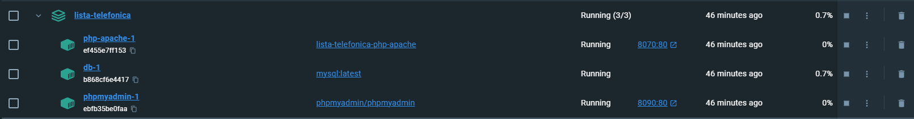

# Lista Telefônica 
## Descrição do projeto 
Um projeto que simula uma lista telefônica com relacionamento de tabelas. Nele são usadas tecnologias de web e banco de dados. 

## Instalação do projeto: 

### Instalação do docker: 
*Instalar o docker no seu computador:*
```
https://www.docker.com/
```

### Clonar repositório do Github
*Pelo site do github:*
```
https://github.com/Projetos-Pucc/lista-telefonica.git
```

*Pelo terminal(CLI):*
```
gh repo clone Projetos-Pucc/lista-telefonica
```


### Inciando o docker-compose 
*No terminal:*
```
# cd para path no qual o repositório foi salvo 
cd lista-telefonica
docker-compose up -d
```
*No editor:* 

Ctr+J (abre a pasta do diretório)
```
docker-compose up 
```

### Acessando a aplicação pelo docker 
No docker, acessar a porta web 8080:80
